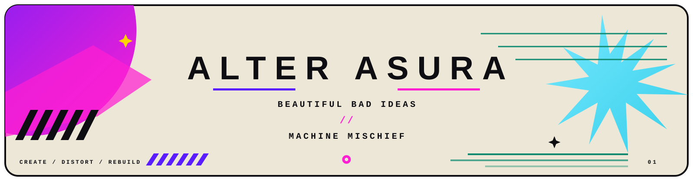

<p align="center">
  
</p>

<br>

<div align="center">

`ART / CODE / BAD DECISIONS`

</div>

<br>

<p align="center">
  
</p>

### `// CURRENTLY CAUSING PROBLEMS`

```text
VISUALS     → making things look louder than necessary
MACHINES    → teaching them questionable behaviour
EXPERIMENTS → starting sensible, ending somewhere else
SIDE QUESTS → permanently enabled
```

<br>

<div align="center">

### `NO ROADMAP. JUST SIDE QUESTS.`

`✦  ◢  ●  ///  ◇  ✦`

</div>

<br>

---

### `// THE LAB`

| | |
|:---:|:---:|
| **VOICES WITHOUT THROATS** | **IMAGES WITHOUT CAMERAS** |
| making machines talk | manufacturing pixels irresponsibly |
| **SYSTEMS WITH OPINIONS** | **THINGS NOBODY REQUESTED** |
| giving logic too much personality | arguably the important work |

<br>

<div align="center">

`CREATE`　→　`DISTORT`　→　`BREAK`　→　`REBUILD`

</div>

<br>

<p align="center">
  
</p>

### `// RULES OF THE LAB`

```diff
+ MAKE WEIRD THINGS
+ MAKE USEFUL THINGS
+ BREAK THINGS ON PURPOSE
+ AUTOMATE BORING SHIT
+ CARE ABOUT HOW THINGS LOOK
+ FINISH SOMETHING OCCASIONALLY

- "AI-POWERED" ON EVERY FUCKING SENTENCE
- EVERYTHING NEEDS TO BE A STARTUP
- BORING = PROFESSIONAL
- RESTRAINT
```

<br>

<details>
<summary><code>DO NOT OPEN THIS</code></summary>

<br>

```text
INITIALIZING BAD IDEA...

[████████████████████] 100%

STATUS  : should probably stop
ACTION  : continued anyway
RESULT  : interesting
```

</details>

<br>

<div align="center">

### `THE MACHINE IS FINE.`

<sub>probably.</sub>

<br><br>

`ALTER ASURA // END OF TRANSMISSION`

</div>
